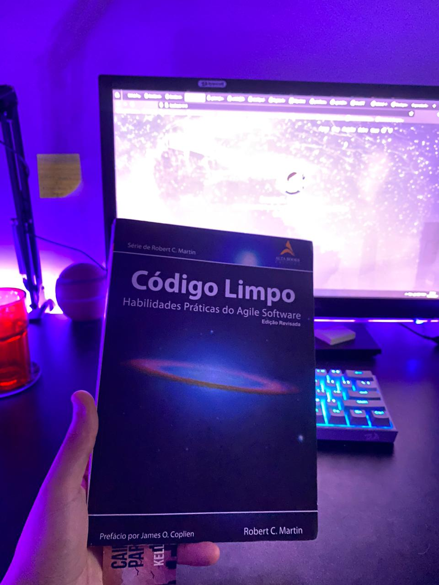
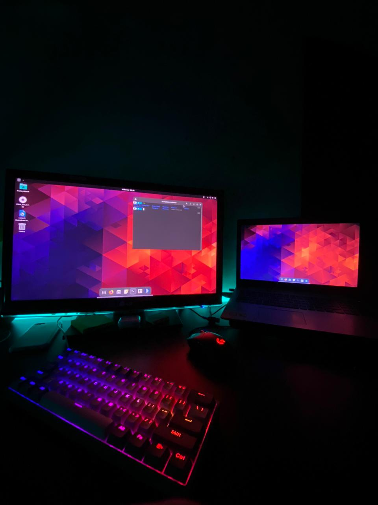

*Está é uma now page, um lugar para compartilhar no que estou focado no momento.*

 

- Fazendo diversos defaios variados com JS.
- Estudando **TypeScript** após pegar um bom conhecimento com JS Vanilla
- Finalmente lendo o meu procrastinado livro, o **Codigo Limpo**
- Començando a usar Linux (Manjaro), ainda utilizo ele com VMVirtualBox, penso seriamente em usar ele como OS principal.

    

      

 

#### Se quiser saber mais sobre o assunto, [What is a “now page”?][nowpage].

[nowpage]: https://nownownow.com/about